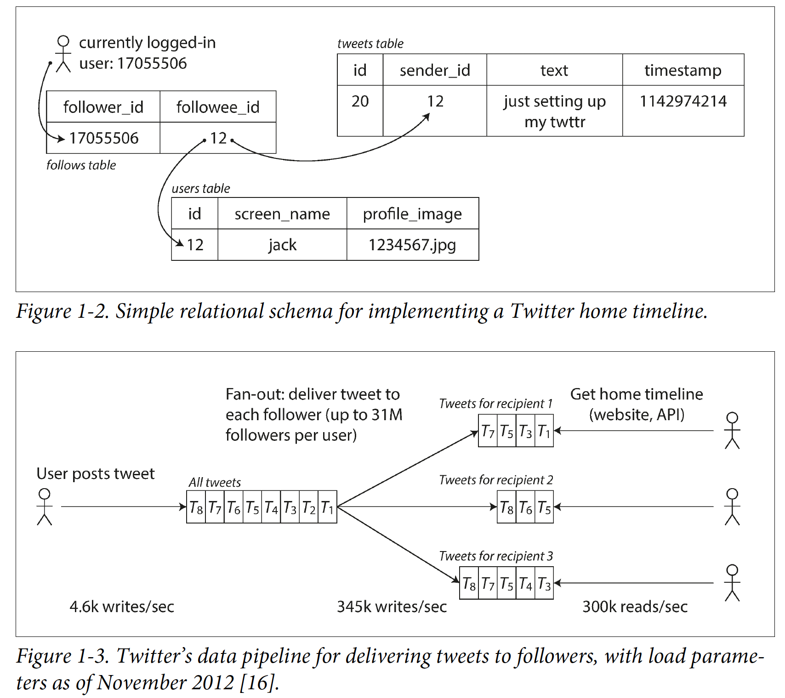

# learn-system-design

<!-- TOC -->

- [learn-system-design](#learn-system-design)
    - [资料](#%E8%B5%84%E6%96%99)
    - [Design process](#design-process)
    - [concepts](#concepts)
        - [reliability](#reliability)
            - [Hardware Faults](#hardware-faults)
            - [Software Errors](#software-errors)
            - [Human Errors](#human-errors)
        - [scalability](#scalability)
            - [Describing Load](#describing-load)
            - [Describing Performance](#describing-performance)

<!-- /TOC -->

## 资料
- 帖子: 
    - https://blog.csdn.net/AuburnTigers/article/details/102601151
    - https://blog.csdn.net/dianxiangong2403/article/details/101879652?spm=1001.2101.3001.6650.3&utm_medium=distribute.pc_relevant.none-task-blog-2%7Edefault%7ECTRLIST%7Edefault-3.no_search_link&depth_1-utm_source=distribute.pc_relevant.none-task-blog-2%7Edefault%7ECTRLIST%7Edefault-3.no_search_link&utm_relevant_index=6
- [第一步](https://www.hiredintech.com/classrooms/system-design/lesson/55)
- 第二步: Designing Data-Intensive Applications
- 第三步: https://github.com/donnemartin/system-design-primer

## Design process
1. make sure you know all the requirements the interviewer didn't tell you about in the beginning
    - Ask yourself "What does it do?"
    - Then, 
        - write the use case and 
            - `As a ... (user), I would like to do ... so that I can ...`
        - constraints
            - QPS, TPM
            - volume of data stored
            - network qos
                - throughput
                - latency
                - packet loss
            - failure rate/availibility
2. design the application service/components (follow below order)
    - data storage layer (DB)
    - service layer
        - XXX service
    - controller layer
        - /api/{...}
    - connection layer
3. List possible bottlenecks for each layer
    - need a load balancer?
    - horizontal scaling DB?
4. discuss the scalability of the design
    - Vertical scaling: 给一台机子升级配置, 但总有个极限的
    - Horizontal scaling: replicate server for the same service in order to serve more requests
    - Load balancing: decide which replicate server to serve this request (least busy? most busy? round robin?)
        - remember a large number for request executing on server X rather than maintaining sessions or storing private IP in cookie
    - Caching
        - needs to consider TTL (time to live) for GC because you can run out of thel limited space
        - Using NoSQL instead of scaling a relational database
            - Cache Database Query result
    - Database replication: making automatically copy of DB
        - Master-slave
            - a slave is a copy of the master
            - balance read requests to slaves
            - master can be single point of failure (solved by master slave switch)
            - slaves can enchance read service's availibility
        - Master-master
            - write on one master will also be execute on other masters
            - solve single point of failure for master-slave
    - Database partitioning: partition DB to different servers and work as a whole
        - Database sharding: let part of users pre-determined to be served by a small server rather than a centralised service (e.g. serve users geographically)
            |advantage||disadvantage||
            |---|---|---|---|
            |High availability|one shard down -> others still work|Rebalancing data| how to make sure data are balanced through all  shards?
            |Faster queries|small data set -> faster query speed|Joining data from multiple shards| too much small data sets -> large join times
            |More write bandwidth|you can write data in different shards -> more write bandwidth compared to master-slave|How do you partition your data in shards?|difficult to decide which field to be stored on which shard
            |
    - Being asynchronous
        - use MQ to consume requets asynchronously

## concepts
|||
|---|---|
|Reliability|The system should continue to work correctly (performing the correct function at the desired level of performance) even in the face of adversity (hardware or software faults, and even human error)
|Scalability|As the system grows (in data volume, traffic volume, or complexity), there should be reasonable ways of dealing with that growth.
|Maintainability|Over time, many different people will work on the system (engineering and operations, both maintaining current behavior and adapting the system to new use cases), and they should all be able to work on it productively.

### reliability
1. The application performs the function that the user expected.
2. It can tolerate the user making mistakes or using the software in unexpected ways.
3. Its performance is good enough for the required use case, under the expected load and data volume.
4. The system prevents any unauthorized access and abuse.

||||
|---|---|---|
|faults|one component of the system deviating from its spec| cannot decrease to 0 -> keep fault-tolerant or resilient
|failure|the system as a whole stops providing the required service to the user

#### Hardware Faults
硬盘坏了, 没电了, etc -> multi-machine redundancy
#### Software Errors
just fix bugs
#### Human Errors
1. write clear docs for API
2. different sandboxs for dev, testing, prod
3. thorough testing
4. Set up detailed and clear monitoring, such as performance metrics and error rates.

### scalability
system’s ability to cope with increased load
#### Describing Load
When we write a tweet to DB, we can wrtie to DB as usual and also maintain a timeline for each twitter post's follower so that followers do not need to query the DB to see the new tweets (just need to read prepared timeline).

#### Describing Performance
|processing system|metric||
|---|---|---|
|batch (Hadoop)|throughput|#records we can process per second
|online batch systems|service’s response time|the time between a client sending a request and receiving a response  - is what clients can see while latency is the duration that a request is waiting to be handled
|stream (Flink)|n/a

service level objectives (SLOs): the expected performance of a service  
service level agreements (SLAs): the expected availability of a service
- both are percentile metric
- 99th percentile for avg response time < 1s can imply
    - 为啥这个指标重要: the customers with the slowest requests are often those who have the most data on their accounts because they have made many purchases (most valuable cunstomer)
    - 不好搞的原因: However, reducing response times at high percentiles is difficult because they are easily affected by random events outside of your control, and the benefits are diminishing

- > [注意] test 的时候要是request有dependency的话, 就可能会在server端head-of-line blocking(request都block在waiting queue里), 从而导致measurements skewed.

#### Approaches for Coping with Load
|||
|---|---|
|vertical scaling|moving to a more powerful machine  
|horizontal scaling|distributing the load across multiple smaller machines

needs to consider the tradeoff: single machine is always better than distributted small machine but it can be expensive if the machine is too powerful.

### Maintainability
three design principles for software systems:
|||
|---|---|
|Operability|Make it easy for operations teams to keep the system running smoothly.
|Simplicity|Make it easy for new engineers to understand the system
|Evolvability (extensibility, modifiability, or plasticity)|Make it easy for engineers to make changes to the system in the future (adapting it for unanticipated use cases as requirements change)

## Data Models and Query Languages
### Relational Model v.s. Document Model
- Why NoSQL databases?
    1. A need for greater scalability than relational databases can easily achieve, including very large datasets or very high write throughput
    2. A widespread preference for free and open source software over commercial database products
    3. Specialized query operations that are not well supported by the relational model
    4. Frustration with the restrictiveness of relational schemas, and a desire for a more dynamic and expressive data model
- Problem of relational model (impedance mismatch)
    - impedance mismatch: 关系型数据库总归需要orm framework来作为一个layer, 从而使得application code可以访问到数据
- Many-to-One and Many-to-Many Relationships

