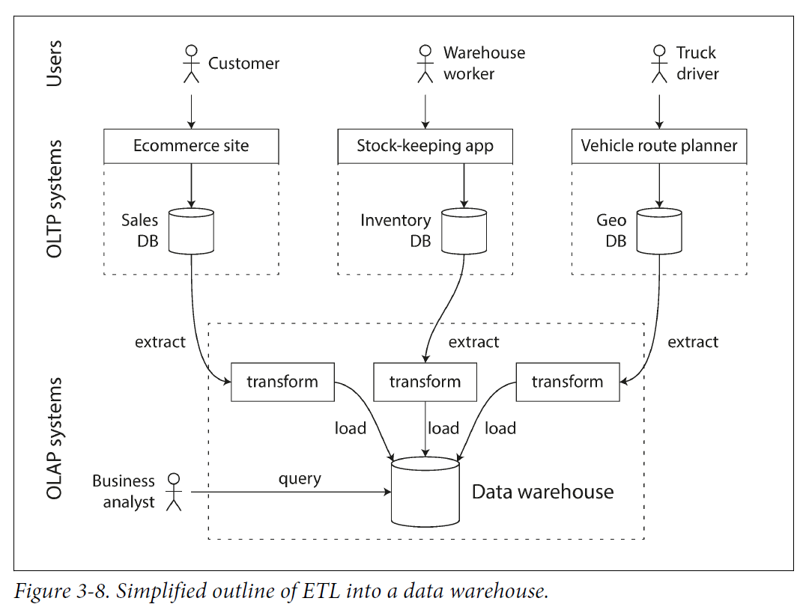

# learn-system-design

<!-- TOC -->

- [learn-system-design](#learn-system-design)
    - [资料](#资料)
    - [Design process](#design-process)
    - [concepts](#concepts)
        - [reliability](#reliability)
            - [Hardware Faults](#hardware-faults)
            - [Software Errors](#software-errors)
            - [Human Errors](#human-errors)
        - [scalability](#scalability)
            - [Describing Load](#describing-load)
            - [Describing Performance](#describing-performance)
            - [Approaches for Coping with Load](#approaches-for-coping-with-load)
        - [Maintainability](#maintainability)
    - [Data Models and Query Languages](#data-models-and-query-languages)
        - [Relational Model v.s. Document Model](#relational-model-vs-document-model)
        - [relational and document databases are becoming more similar over time](#relational-and-document-databases-are-becoming-more-similar-over-time)
        - [summary](#summary)
    - [Storage and Retrieval](#storage-and-retrieval)
        - [index data structure](#index-data-structure)
            - [using index](#using-index)
            - [comparison](#comparison)
            - [hash index](#hash-index)
            - [sorted string table (SSTable) and LSM tree](#sorted-string-table-sstable-and-lsm-tree)
            - [B-tree](#b-tree)
        - [Transaction Processing or Analytics?](#transaction-processing-or-analytics)
            - [OLTP engine type](#oltp-engine-type)

<!-- /TOC -->

## 资料
- 帖子: 
    - https://blog.csdn.net/AuburnTigers/article/details/102601151
    - https://blog.csdn.net/dianxiangong2403/article/details/101879652?spm=1001.2101.3001.6650.3&utm_medium=distribute.pc_relevant.none-task-blog-2%7Edefault%7ECTRLIST%7Edefault-3.no_search_link&depth_1-utm_source=distribute.pc_relevant.none-task-blog-2%7Edefault%7ECTRLIST%7Edefault-3.no_search_link&utm_relevant_index=6
- [第一步](https://www.hiredintech.com/classrooms/system-design/lesson/55)
- 第二步: Designing Data-Intensive Applications
- 第三步: https://github.com/donnemartin/system-design-primer

## Design process
1. make sure you know all the requirements the interviewer didn't tell you about in the beginning
    - Ask yourself "What does it do?"
    - Then, 
        - write the use case and 
            - `As a ... (user), I would like to do ... so that I can ...`
        - constraints
            - QPS, TPM
            - volume of data stored
            - network qos
                - throughput
                - latency
                - packet loss
            - failure rate/availibility
2. design the application service/components (follow below order)
    - data storage layer (DB)
    - service layer
        - XXX service
    - controller layer
        - /api/{...}
    - connection layer
3. List possible bottlenecks for each layer
    - need a load balancer?
    - horizontal scaling DB?
4. discuss the scalability of the design
    - Vertical scaling: 给一台机子升级配置, 但总有个极限的
    - Horizontal scaling: replicate server for the same service in order to serve more requests
    - Load balancing: decide which replicate server to serve this request (least busy? most busy? round robin?)
        - remember a large number for request executing on server X rather than maintaining sessions or storing private IP in cookie
    - Caching
        - needs to consider TTL (time to live) for GC because you can run out of thel limited space
        - Using NoSQL instead of scaling a relational database
            - Cache Database Query result
    - Database replication: making automatically copy of DB
        - Master-slave
            - a slave is a copy of the master
            - balance read requests to slaves
            - master can be single point of failure (solved by master slave switch)
            - slaves can enchance read service's availibility
        - Master-master
            - write on one master will also be execute on other masters
            - solve single point of failure for master-slave
    - Database partitioning: partition DB to different servers and work as a whole
        - Database sharding: let part of users pre-determined to be served by a small server rather than a centralised service (e.g. serve users geographically)
            |advantage||disadvantage||
            |---|---|---|---|
            |High availability|one shard down -> others still work|Rebalancing data| how to make sure data are balanced through all  shards?
            |Faster queries|small data set -> faster query speed|Joining data from multiple shards| too much small data sets -> large join times
            |More write bandwidth|you can write data in different shards -> more write bandwidth compared to master-slave|How do you partition your data in shards?|difficult to decide which field to be stored on which shard
            |
    - Being asynchronous
        - use MQ to consume requets asynchronously

## concepts
|||
|---|---|
|Reliability|The system should continue to work correctly (performing the correct function at the desired level of performance) even in the face of adversity (hardware or software faults, and even human error)
|Scalability|As the system grows (in data volume, traffic volume, or complexity), there should be reasonable ways of dealing with that growth.
|Maintainability|Over time, many different people will work on the system (engineering and operations, both maintaining current behavior and adapting the system to new use cases), and they should all be able to work on it productively.

### reliability
1. The application performs the function that the user expected.
2. It can tolerate the user making mistakes or using the software in unexpected ways.
3. Its performance is good enough for the required use case, under the expected load and data volume.
4. The system prevents any unauthorized access and abuse.

||||
|---|---|---|
|faults|one component of the system deviating from its spec| cannot decrease to 0 -> keep fault-tolerant or resilient
|failure|the system as a whole stops providing the required service to the user

#### Hardware Faults
硬盘坏了, 没电了, etc -> multi-machine redundancy
#### Software Errors
just fix bugs
#### Human Errors
1. write clear docs for API
2. different sandboxs for dev, testing, prod
3. thorough testing
4. Set up detailed and clear monitoring, such as performance metrics and error rates.

### scalability
system’s ability to cope with increased load
#### Describing Load
When we write a tweet to DB, we can wrtie to DB as usual and also maintain a timeline for each twitter post's follower so that followers do not need to query the DB to see the new tweets (just need to read prepared timeline).

#### Describing Performance
|processing system|metric||
|---|---|---|
|batch (Hadoop)|throughput|#records we can process per second
|online batch systems|service’s response time|the time between a client sending a request and receiving a response  - is what clients can see while latency is the duration that a request is waiting to be handled
|stream (Flink)|n/a

service level objectives (SLOs): the expected performance of a service  
service level agreements (SLAs): the expected availability of a service
- both are percentile metric
- 99th percentile for avg response time < 1s can imply
    - 为啥这个指标重要: the customers with the slowest requests are often those who have the most data on their accounts because they have made many purchases (most valuable cunstomer)
    - 不好搞的原因: However, reducing response times at high percentiles is difficult because they are easily affected by random events outside of your control, and the benefits are diminishing

- > [注意] test 的时候要是request有dependency的话, 就可能会在server端head-of-line blocking(request都block在waiting queue里), 从而导致measurements skewed.

#### Approaches for Coping with Load
|||
|---|---|
|vertical scaling|moving to a more powerful machine  
|horizontal scaling|distributing the load across multiple smaller machines

needs to consider the tradeoff: single machine is always better than distributted small machine but it can be expensive if the machine is too powerful.

### Maintainability
three design principles for software systems:
|||
|---|---|
|Operability|Make it easy for operations teams to keep the system running smoothly.
|Simplicity|Make it easy for new engineers to understand the system
|Evolvability (extensibility, modifiability, or plasticity)|Make it easy for engineers to make changes to the system in the future (adapting it for unanticipated use cases as requirements change)

## Data Models and Query Languages
### Relational Model v.s. Document Model
- Why NoSQL databases?
    1. A need for greater scalability than relational databases can easily achieve, including very large datasets or very high write throughput
    2. A widespread preference for free and open source software over commercial database products
    3. Specialized query operations that are not well supported by the relational model
    4. Frustration with the restrictiveness of relational schemas, and a desire for a more dynamic and expressive data model
- Problem of relational model (impedance mismatch)
    - impedance mismatch: 关系型数据库总归需要orm framework来作为一个layer, 从而使得application code可以访问到数据
- Many-to-One and Many-to-Many Relationships
    - ||advantage|disadvantage|
      |---|---|---|
      |Using an id for row|it has no meaning to humans, it never needs to change: the ID can remain the same, even if the information it identifies changes|1. incurs write overheads 2. risks inconsistencies (where some copies of the information are updated but others aren’t)
    - Need to consider normalization (范式化)
- ||Relational DB|Document DB|Graph DB
  |---|---|---|---|
  |simpler application code|uses forengin key for multiple tables -> lots of useless schema & complicated code|the application has a document-like structure (1-to-many relationship)
  |data accessibility||bad: difficult to get second position in user's position list because you need to load the whole user
  |join support||(not a problem if many-to-many scenario not needed) many-to-many relationship case -> more complex application code and worse performance
  |highly interconnected data|acceptable||acceptable
  |Schema flexibility (hard to say good/bad)|schemaless if data stored in json/xml|better supported
  |Data locality for queries|1. Google’s Spanner database offers the same locality properties 2. Oracle: multi-table index cluster tables 3. column-family concept in the Bigtable data model (used in Cassandra and HBase)|- advantage: only applies if you need large parts of the document at the same time -> data are gatheredto be loaded locally together regardless of which part of the document needed - disadvantage: documents always encoded (json/xml/MongoDB’s BSON) -> modification/read requires to load the whole document
  ||
### relational and document databases are becoming more similar over time
|relational DB|data model support|
|---|---|
|Most relational database systems (other than MySQL)|supported XML since the mid-2000s so that have a document-like way of DB
|PostgreSQL since version 9.3|support for JSON documents
|MySQL since version 5.7|support for JSON documents
|

|document DB||
|---|---|
|RethinkDB|supports relational-like joins in its query language
|some MongoDB drivers|automatically resolve database references (effectively performing a client-side join, although this is likely to be slower than a join performed in the database since it requires additional network round-trips and is less optimized)

### summary
- If your application has mostly one-to-many relationships (tree-structured data) || no relationships between records, 
    - the document model is appropriate.
- if many-to-many relationships are very common || the connections within your data become more complex
    - the graph model is appropriate

## Storage and Retrieval
### index data structure
#### using index
||advantage|disadvantage|
|---|---|---|
|index|can speed up read queries|every index slows down writes (you also need to update index)
#### comparison
||advantage|disadvantage|
|---|---|---|
|hash index|1. fast to check existance O(1)|1. The hash table must fit in memory -> needs to access disk a lot 2. Range queries are not efficient -> B+ tree
|SSTable|Goog big data table paper 1. LevelDB 2. RocksDB 3. Cassandra 4. HBase
|LSM Tree|1. sorted keys -> support range query 2. sequential keys by disk writes during merging -> high write throughput|1. slow to check not exist -> bloom filter
|B-tree|1. small amount of pages loaded from disk for one search because search is O(log n)|

||LSM-Tree|B-Tree
|---|---|---|
|write-heavy application|**lower write amplification (#disk writes w.r.t. DB write operation)**|requires 2 times (undo log + disk page write)
|quert stability|can be highly influences compaction operation|**stable for B+**
|key existance|same key in different segment files|**unique key in DB**
|different workload performance (really depends on practice)||**good**
|

#### hash index
每个file都是包含多个{key: value}的data file segment

所以需要compaction: 将每一个file里面重复的key更新为不重复的且value = 最新的value

#### sorted string table (SSTable) and LSM tree
相较于hash index每个data file segment的key都sorted, 所以可以快速的定位到key

- In memory: AVL tree/red-black tree
- Disk: data log segment
- Cash recovery: append only file

Considering merge: LSM (Log-structured merge) tree = keeping a cascade of SSTable **<u>merged in background</u>**
||size-tiered compaction|leveled compaction|
|---|---|---|
|LevelDB||Y
|RocksDB||Y
|HBase|Y
|Cassandra|Y|Y

#### B-tree

ACID property for problem like crash recovery
- concurrency control techniques

### Transaction Processing or Analytics?
- OLTP: Online Transaction Processing
- OLAP: Online Analytical Processing

|diff|OLTP|OLAP/Data_warehouse|
|---|---|---|
|Main read pattern| Small number of records per query, fetched by key| Aggregate over large number of records
|Main write pattern| Random-access, low-latency writes from user input| Bulk import (ETL) or event stream
|Primarily used by| End user/customer, via web application - large volume of requests each with small amount of records |Internal analyst, for decision support - small volume of requests each with large amount of records scanned in a short time
|What data represents| Latest state of data (current point in time)| History of events that happened over time
|Dataset size| Gigabytes to terabytes| Terabytes to petabytes
|Bottleneck|Disk seek time can be solved by: index|Disk bandwidth can be solved by: column storage to encode data "correctly" (index is not important because you are scanning disk sequentially)

#### OLTP engine type
||||
|---|---|---|
|log-structured|only permits appending to files and deelte outdated files|SSTable, LSM-Tree, LevelDB, Cassandra, HBase, Lucene, mmm
|update-in-place|treat disk as a set of fixed size of modifiable pages|B-tree

